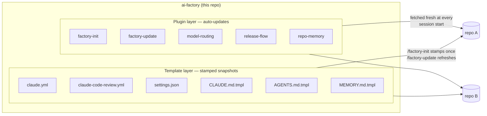
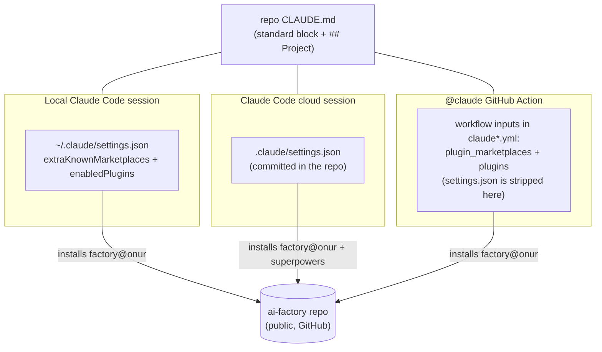
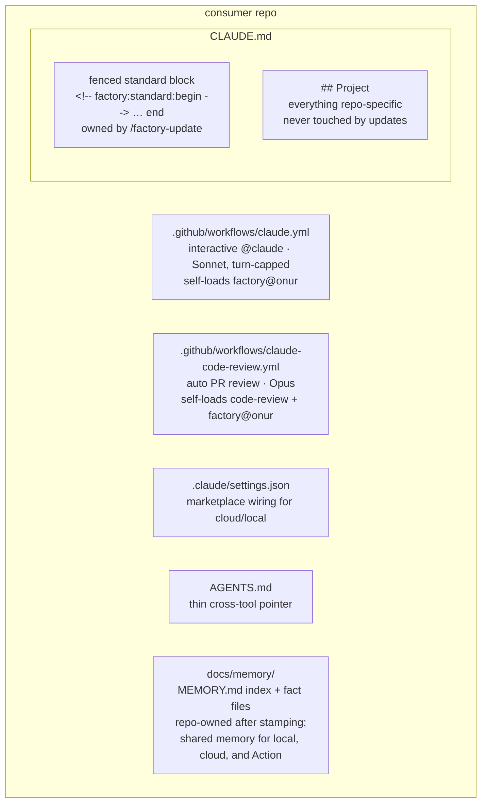
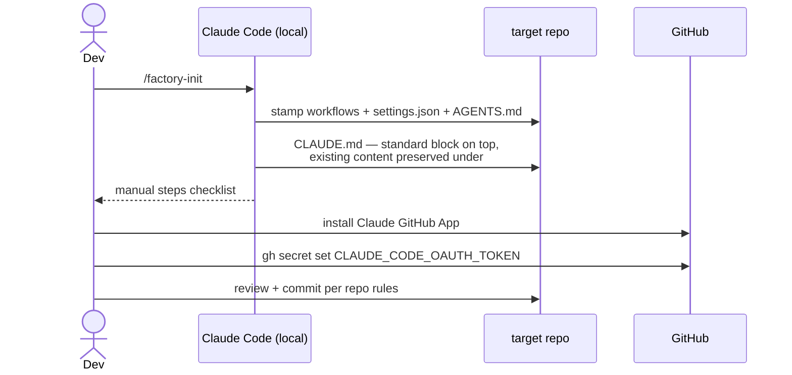
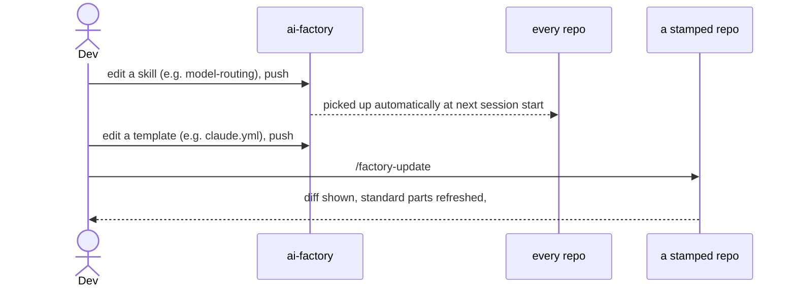

# ai-factory

Personal Claude Code **plugin marketplace + repo templates** in one repo.
It is the single source of truth for how AI agents (local Claude Code
sessions, Claude Code cloud sessions, and the `@claude` GitHub Action) work
across all of my repositories, so a new project takes one command to set up
instead of hand-copying workflows and CLAUDE.md prose.

- Marketplace: **`onur`** · Plugin: **`factory`**
- Works with any repo — nothing here is coupled to a specific consumer.
- Design spec: [`docs/superpowers/specs/2026-07-08-ai-factory-design.md`](docs/superpowers/specs/2026-07-08-ai-factory-design.md)

## Why this exists

Every repo that works with Claude agents needs the same setup: the two
`@claude` workflows, plugin wiring, a secret, and the same CLAUDE.md
prose about model routing and release discipline. Hand-copying that
across repos is how drift happens — before this repo, the agent-enabled
repos each carried slightly different, already-diverging variants, and
every new project restarted from zero.

Two facts shaped the design:

1. **Remote agents only see the repo.** `@claude` Action runs, Claude
   Code cloud sessions, and scheduled routines never load `~/.claude`,
   so everything shared must be reachable *from the repo itself*:
   plugin wiring committed per-repo, and durable knowledge (CLAUDE.md,
   `docs/memory/`) carried by git rather than by any one machine. A new
   or reinstalled computer needs nothing beyond `git pull` and the
   one-time marketplace add.
2. **Different content wants different update semantics.** Process and
   policy (model routing, release flow, memory conventions) should
   evolve once and propagate everywhere immediately — that is the
   plugin layer. Files a repo must own and review (workflows,
   CLAUDE.md) should change only deliberately and visibly — that is the
   stamped layer, refreshed per-repo by `/factory-update`, with the
   marker fence protecting everything the repo has learned.

The repo is public so remote marketplace fetches need no token
plumbing; it contains only config, skills, and templates — never
secrets. Frameworks in this space (spec-kit, Agent OS, BMAD) were
evaluated and rejected as team-oriented "work about work" for a solo
developer — see the design spec for the full comparison. This repo is
deliberately just files: no runtime, no DSL, nothing to maintain beyond
what you can read in a minute.

## How it is meant to be used

- **New repo:** `git init`, `/factory-init`, follow the two-step
  checklist (GitHub App install + one secret). The repo is now
  agent-ready: `@claude` responder, auto PR review, plugin wiring,
  memory index.
- **Improving the standard:** edit a skill here and push — every repo
  picks it up at its next session start. Edit a template here, then run
  `/factory-update` in each consuming repo at your convenience.
- **Day to day:** you never think about this repo. Consumer repos carry
  their own rules (CLAUDE.md `## Project`) and memory (`docs/memory/`);
  the plugin carries the shared policies; and any drift that sneaks in
  is one `/factory-update` away from fixed.

## The two layers

Everything here belongs to one of two layers with different update
semantics. Skills auto-propagate; stamped files are per-repo snapshots.



| Layer | Lives in | Reaches repos | Update model |
|---|---|---|---|
| Skills (`factory-init`, `factory-update`, `model-routing`, `release-flow`, `repo-memory`) | `plugins/factory/skills/` | via plugin install | **automatic** — sessions fetch the current version at start |
| Stamped files (workflows, `.claude/settings.json`, `CLAUDE.md`, `AGENTS.md`, `docs/memory/MEMORY.md`) | `plugins/factory/templates/` | copied into each repo | **snapshot** — frozen until you run `/factory-update` there |

## How config reaches each environment

The load-bearing constraint (verified live, 2026-07-08): remote agents
never see `~/.claude`, and the `@claude` GitHub Action additionally
**strips the repo's `.claude/settings.json`** before the session starts.
So plugins reach each environment by a different road:



Notes that came out of live verification rather than the docs:

- The Action ignores/strips `.claude/settings.json`, so the stamped
  workflows **self-load** the plugin via newline-separated
  `plugin_marketplaces` / `plugins` inputs. Keep both mechanisms in place.
- `superpowers` (the process-skills plugin) is intentionally **not** loaded
  into Action runs — the turn-capped CI responder has no use for it and it
  costs context. It stays local + cloud.
- Locally, listing a plugin under `enabledPlugins` alone may not surface it;
  a one-time `claude plugin install factory@onur` finishes the job.

## What a stamped repo looks like



The marker fence is the contract that makes updates safe: `/factory-update`
rewrites **only** the text between the markers; the `## Project` section
(DSP rules, deploy quirks, hard-won gotchas) belongs to the repo forever.

## Lifecycle

### New (or existing) repo → standardized



Idempotent: re-running reports "already current" / "already initialized"
and changes nothing.

### Improving the standard later



## The skills

| Skill | What it does |
|---|---|
| `factory-init` | Stamps the current repo with the full standard (see lifecycle above). Never overwrites silently; merges an existing `settings.json`; three-case CLAUDE.md handling. |
| `factory-update` | Refreshes only the standard parts: both workflows, plugin wiring in `settings.json`, and the fenced CLAUDE.md block. Refuses to run on un-initialized repos. |
| `model-routing` | Token-efficiency policy: Haiku for fully-specified implementer tasks, Sonnet for reviewers/fixes/CI responder (`--model claude-sonnet-5 --max-turns 10`), Opus for research/design and the once-per-PR review. Always pin models explicitly. |
| `release-flow` | Local vs remote discipline: local work gates on `/code-review` before any push that reaches users; the remote `@claude` agent never pushes `main` and always opens a PR. Repo-specific push/deploy rules live in each repo's `## Project`. |
| `repo-memory` | Repo-committed agent memory: `docs/memory/MEMORY.md` index + one fact per file, readable by every environment (local, cloud, Action) because it lives in the repo. Read the index before nontrivial work; record non-obvious reusable learnings in the same PR; review is the gardening step. |

## Using it

```bash
# one-time, on a new machine
claude  →  /plugin marketplace add onurcelep/ai-factory
claude plugin install factory@onur

# per repo
cd my-new-project && git init
claude  →  /factory-init          # stamp everything, follow the checklist

# after templates change in ai-factory
claude  →  /factory-update        # inside each consuming repo
```

## Repo layout

```
ai-factory/
├── .claude-plugin/marketplace.json     # marketplace "onur"
├── plugins/factory/
│   ├── .claude-plugin/plugin.json      # plugin manifest
│   ├── skills/                         # auto-updating layer
│   │   ├── factory-init/SKILL.md
│   │   ├── factory-update/SKILL.md
│   │   ├── model-routing/SKILL.md
│   │   ├── release-flow/SKILL.md
│   │   └── repo-memory/SKILL.md
│   └── templates/                      # stamped layer
│       ├── claude.yml
│       ├── claude-code-review.yml
│       ├── settings.json
│       ├── CLAUDE.md.tmpl
│       ├── AGENTS.md.tmpl
│       └── MEMORY.md.tmpl
├── docs/superpowers/specs/             # design spec
├── docs/superpowers/plans/             # implementation plan (historical record)
└── scripts/validate.sh                 # run after any change here
```

## Contributing to your own standard

1. Edit skills/templates here.
2. `./scripts/validate.sh` must print `ALL CHECKS PASSED`.
3. Commit, push. Skills are live everywhere immediately; run
   `/factory-update` in consuming repos when templates changed.
