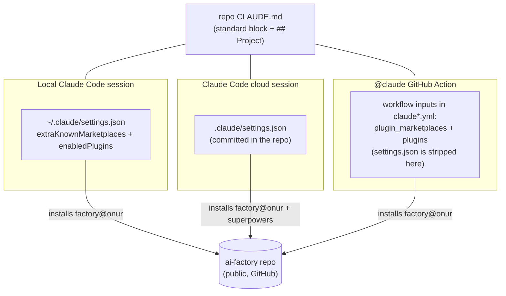

# ai-factory

Make any GitHub repository agent-ready in one command. This repo is both a
Claude Code **plugin marketplace** (shared skills that update everywhere at
once) and a **template source** (workflows, settings, CLAUDE.md stamped
into each repo). It exists because hand-copying that setup across repos is
how drift happens.

## Why

A stamped repo gets you, in plain terms:

- **An AI teammate you assign work through GitHub** — open an issue, tag
  `@claude`, review the PR it hands back. It can never touch `main`.
- **Every pull request reviewed automatically** by a strong model before
  you look at it.
- **Agents that know your project** — local, cloud, and CI sessions all
  follow the same committed rules (`CLAUDE.md`) and share the same
  committed memory (`docs/memory/`).
- **A setup that maintains itself** — one command to stamp, one to audit,
  and updates arrive fleet-wide as ready-to-merge PRs.

None of the mechanism is secret sauce — it composes official Claude Code
features. What this repo adds is a **maintained, opinionated, tested
implementation**: every default has a written reason
([docs/DECISIONS.md](docs/DECISIONS.md)), the skills are guarded by their
own [eval suite](evals/README.md), and `rebrand.sh` turns a fork into
*your* standard in one command. You are not adopting a framework; you are
forking a working setup with its reasoning attached.

Marketplace **`onur`** · plugin **`factory`** · public on purpose (remote
marketplace fetches need no token; nothing here ever contains a secret).

## Where to go

| You want to… | Read |
|---|---|
| Stamp your first repo | [Quick start](#quick-start) + [Prerequisites](#prerequisites) |
| Understand how the pieces fit | [How it works](#how-it-works), below |
| Work effectively in a stamped repo — which agent surface for which task, the habits that compound | [docs/WORKING.md](docs/WORKING.md) |
| Maintain the fleet — updates, propagation, versions, cost, rollback | [docs/OPERATIONS.md](docs/OPERATIONS.md) |
| Fork it — rebrand, process layer, billing, model choices | [docs/FORKING.md](docs/FORKING.md) |
| See every default and its reason | [docs/DECISIONS.md](docs/DECISIONS.md) |
| Change skills or templates — here or in your fork | [CONTRIBUTING.md](CONTRIBUTING.md) + [evals/README.md](evals/README.md) |
| Check the trust boundaries | [docs/SECURITY-MODEL.md](docs/SECURITY-MODEL.md) |

## Quick start

```bash
# one-time, per machine
claude  →  /plugin marketplace add onurcelep/ai-factory
claude plugin install factory@onur

# per repo
cd my-project && git init
claude  →  /factory-init      # stamps everything, prints the manual steps

# after templates change in ai-factory
claude  →  /factory-update    # per repo — or enable auto-propagation
claude  →  /factory-status    # fleet check: which repos are stale
```

`/factory-init` stamps the `@claude` workflows, `.claude/settings.json`
plugin wiring, a marker-fenced `CLAUDE.md`, `AGENTS.md`, and a
`docs/memory/` index — then prints the two steps it cannot do for you
(install the [Claude GitHub App](https://github.com/apps/claude), set the
auth secret). It is idempotent and never overwrites existing content
silently. Day-2 operations live in
[docs/OPERATIONS.md](docs/OPERATIONS.md).

## Prerequisites

`/factory-init` checks all of these in its preflight and prints the fix
for anything missing — reading ahead just saves the round trip.

| Requirement | Why | Verify |
|---|---|---|
| [Claude Code](https://claude.com/claude-code) CLI, logged in | runs the skills; installs the plugins at session start | `claude --version` |
| A Claude subscription able to mint an OAuth token — or an API key, see [billing](docs/FORKING.md#billing-subscription-or-api-key) | the `@claude` workflows authenticate with the `CLAUDE_CODE_OAUTH_TOKEN` secret (API-key forks: `ANTHROPIC_API_KEY`) | `claude setup-token` |
| `git` + a GitHub-hosted target repo | the workflows are GitHub Actions; the marketplace is fetched from GitHub | `git remote -v` |
| `gh` CLI, authenticated | `/factory-init`'s preflight and `gh secret set` | `gh auth status` |
| Claude GitHub App installed on the target repo or org | lets the Actions react to `@claude` mentions and PRs | https://github.com/apps/claude |
| `bash` + `python3` | only for hacking on this repo itself (`validate.sh`, `rebrand.sh`) | `python3 --version` |

## How it works

Two layers with different update semantics:

| Layer | Lives in | Update model |
|---|---|---|
| Skills — `factory-init`, `factory-update`, `factory-status`, `model-routing`, `release-flow`, `repo-memory`, `ci-agent-ops` | `plugins/factory/skills/` | **automatic** — every session fetches the current version at start |
| Stamped files — workflows, `.claude/settings.json`, `CLAUDE.md`, `AGENTS.md`, `docs/memory/MEMORY.md` | `plugins/factory/templates/` | **snapshot** — frozen per repo until you run `/factory-update` there |

CLAUDE.md is the contract between the two: `/factory-update` rewrites only
the marker-fenced standard block, and the `## Project` section — the
repo's own rules and hard-won knowledge — is never touched.

Config reaches each environment by a different road, because remote agents
never see `~/.claude` and the `@claude` Action additionally **strips the
repo's `.claude/settings.json`** (verified live, 2026-07-08):



The skills themselves are tested, not assumed: trigger/routing evals gate
every PR, and behavioral evals verify that an agent *following* a skill
actually behaves as promised — details in
[evals/README.md](evals/README.md).

## Repo layout

```
ai-factory/
├── plugins/factory/        # everything agents receive: skills (auto-updating),
│                           #   templates (version-gated snapshots), routed
│                           #   agents, protect-main hook
├── evals/                  # skill eval suite — cases + docs
├── tests/                  # unit tests + stamping fixtures
├── docs/                   # one doc per question — see "Where to go" above
├── scripts/                # validate.sh, run-evals.py, rebrand.sh, cost-report.sh
├── .github/workflows/      # this repo's CI: validate, version-guard,
│                           #   propagation, frontier audit, dogfooded templates
├── CLAUDE.md               # agent entry point for working on this repo
└── CONTRIBUTING.md         # the rules validate.sh enforces, explained
```

Changing the standard — which layer to touch, what must pass, when to
bump the version: [CONTRIBUTING.md](CONTRIBUTING.md).
