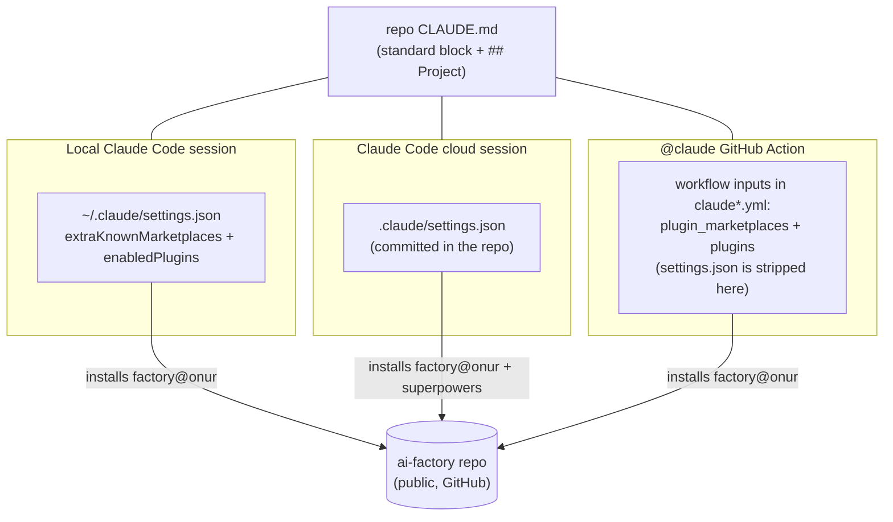

# ai-factory

Make any GitHub repository agent-ready in one command. This repo is both a
Claude Code **plugin marketplace** (shared skills that update everywhere at
once) and a **template source** (workflows, settings, CLAUDE.md stamped
into each repo). It exists because hand-copying that setup across repos is
how drift happens.

- Marketplace **`onur`** · plugin **`factory`**
- Public on purpose: remote marketplace fetches need no token, and nothing
  here ever contains a secret
- Fork-friendly: [`scripts/rebrand.sh`](#use-it-as-a-base) repoints
  everything at your own fork
- Full rationale and alternatives considered: [design spec](docs/superpowers/specs/2026-07-08-ai-factory-design.md)

## Quick start

Check the [prerequisites](#prerequisites) first.

```bash
# one-time, per machine
claude  →  /plugin marketplace add onurcelep/ai-factory
claude plugin install factory@onur

# per repo
cd my-project && git init
claude  →  /factory-init      # stamps everything, prints the manual steps

# after templates change in ai-factory
claude  →  /factory-update    # inside each consuming repo
```

`/factory-init` stamps the two `@claude` workflows, `.claude/settings.json`
plugin wiring, a marker-fenced `CLAUDE.md`, `AGENTS.md`, and a
`docs/memory/` index — then prints the two steps it cannot do for you:
install the [Claude GitHub App](https://github.com/apps/claude) and
`gh secret set CLAUDE_CODE_OAUTH_TOKEN`. It is idempotent and never
overwrites existing content silently.

## Prerequisites

| Requirement | Why | Verify |
|---|---|---|
| [Claude Code](https://claude.com/claude-code) CLI, logged in | runs the skills; installs the plugins at session start | `claude --version` |
| A Claude subscription able to mint an OAuth token | the `@claude` workflows authenticate with the `CLAUDE_CODE_OAUTH_TOKEN` secret | `claude setup-token` |
| `git` + a GitHub-hosted target repo | the workflows are GitHub Actions; the marketplace is fetched from GitHub | `git remote -v` |
| `gh` CLI, authenticated | `/factory-init`'s preflight and `gh secret set` | `gh auth status` |
| Claude GitHub App installed on the target repo or org | lets the Actions react to `@claude` mentions and PRs | https://github.com/apps/claude |
| `bash` + `python3` | only for hacking on this repo itself (`validate.sh`, `rebrand.sh`) | `python3 --version` |

## How it works

Two layers with different update semantics:

| Layer | Lives in | Update model |
|---|---|---|
| Skills — `factory-init`, `factory-update`, `model-routing`, `release-flow`, `repo-memory` | `plugins/factory/skills/` | **automatic** — every session fetches the current version at start |
| Stamped files — workflows, `.claude/settings.json`, `CLAUDE.md`, `AGENTS.md`, `docs/memory/MEMORY.md` | `plugins/factory/templates/` | **snapshot** — frozen per repo until you run `/factory-update` there |

CLAUDE.md is the contract between the two: `/factory-update` rewrites only
the marker-fenced standard block, and the `## Project` section — the repo's
own rules and hard-won knowledge — is never touched.

Config reaches each environment by a different road, because remote agents
never see `~/.claude` and the `@claude` Action additionally **strips the
repo's `.claude/settings.json`** (verified live, 2026-07-08):



- Locally, a one-time `claude plugin install factory@onur` may be needed —
  `enabledPlugins` alone does not always surface a plugin.
- `superpowers` (the process-skills plugin) loads local + cloud only; the
  turn-capped Action responder has no use for it and skips it deliberately.

## The decisions

What a repository signs up for when it adopts ai-factory. Each row is a
deliberate decision; the linked skill or template is its source of truth.

| Decision | Lives in |
|---|---|
| Two GitHub workflows per repo: an interactive `@claude` responder (Sonnet, turn-capped) and an automatic once-per-PR review (Opus). Models are always pinned explicitly — an omitted model silently inherits an expensive default. | `templates/claude*.yml` |
| Model routing by task: Haiku for fully-specified implementer tasks, Sonnet for judgment/fix/responder work, Opus for research, design, and the PR review. Escalate one level on repeated failure, never by default. | `model-routing` skill |
| Release discipline: local work gates on `/code-review` before any push that reaches users; the remote `@claude` agent never pushes `main` and always opens a PR (its workflow runs with `contents: read`). | `release-flow` skill |
| CLAUDE.md is layered: a marker-fenced standard block owned by `/factory-update`, and a `## Project` section owned by the repo forever — updates can never destroy repo-specific knowledge. | `templates/CLAUDE.md.tmpl` |
| Agent memory is committed to the repo (`docs/memory/`: index + one fact per file), so local, cloud, and Action sessions share the same knowledge with zero machine state. | `repo-memory` skill |
| Plugin wiring is redundant by design: `.claude/settings.json` covers local and cloud sessions; the workflows self-load the plugin for Action runs, which strip `settings.json`. | `templates/settings.json` + workflows |
| superpowers is the process layer for local and cloud sessions only; it is intentionally not loaded into Action runs (context cost, no benefit for a turn-capped responder). | `templates/settings.json` |
| One secret per consumer repo (`CLAUDE_CODE_OAUTH_TOKEN`); this repo stays public and never carries secrets. | `/factory-init` checklist |
| `AGENTS.md` is a thin cross-tool pointer to CLAUDE.md, nothing more. | `templates/AGENTS.md.tmpl` |

## Use it as a base

Everything functional is owner-agnostic except two strings — the GitHub
repo slug and the marketplace name — and one script rewrites both:

```bash
gh repo fork onurcelep/ai-factory --clone    # or "Use this template" on GitHub
cd ai-factory
./scripts/rebrand.sh <your-github-user>/ai-factory    # optional 2nd arg: marketplace name
```

The script rewrites the manifests, templates, and README, then re-runs the
validation suite (which checks cross-file consistency, not owner literals,
so it passes for any fork). Review the diff, optionally put your own name
in the two manifests' owner/author fields, push — then continue from
[Quick start](#quick-start) with your own slug. Keep the fork public and
secret-free; from there the skills and templates are yours to edit.

## Repo layout

```
ai-factory/
├── .claude-plugin/marketplace.json     # marketplace "onur"
├── plugins/factory/
│   ├── .claude-plugin/plugin.json      # plugin manifest
│   ├── skills/                         # auto-updating layer
│   │   ├── factory-init/SKILL.md
│   │   ├── factory-update/SKILL.md
│   │   ├── model-routing/SKILL.md
│   │   ├── release-flow/SKILL.md
│   │   └── repo-memory/SKILL.md
│   └── templates/                      # stamped layer
│       ├── claude.yml
│       ├── claude-code-review.yml
│       ├── settings.json
│       ├── CLAUDE.md.tmpl
│       ├── AGENTS.md.tmpl
│       └── MEMORY.md.tmpl
├── docs/superpowers/specs/             # design spec
├── docs/superpowers/plans/             # implementation plan (historical record)
├── scripts/validate.sh                 # run after any change here
└── scripts/rebrand.sh                  # repoint a fork at your own repo
```

Changing the standard: edit skills or templates, run
`./scripts/validate.sh` (must print `ALL CHECKS PASSED`), push. Skill
edits are live everywhere at the next session start; template edits reach
each repo when you run `/factory-update` there.
