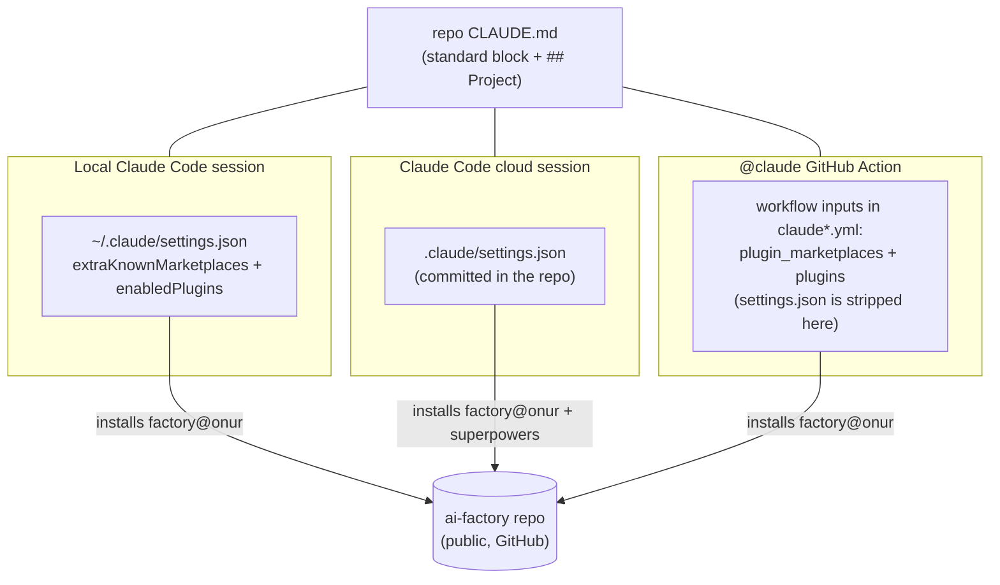

# ai-factory

Make any GitHub repository agent-ready in one command. This repo is both a
Claude Code **plugin marketplace** (shared skills that update everywhere at
once) and a **template source** (workflows, settings, CLAUDE.md stamped
into each repo). It exists because hand-copying that setup across repos is
how drift happens.

## Why

If you're new to working with AI coding agents, here is what a stamped
repo actually gets you, in plain terms:

- **An AI teammate you assign work through GitHub.** Open an issue
  describing a change and tag `@claude`: an agent reads your repo, makes
  the change on a branch, and hands you a pull request. You review and
  merge; it can never touch `main` directly.
- **Every pull request reviewed automatically** by a strong model before
  you look at it — bugs and project-rule violations flagged once per PR,
  with no reviewer to schedule.
- **Agents that know your project.** Local Claude Code sessions, cloud
  sessions, and the GitHub agents all follow the same committed rules
  (`CLAUDE.md`) and share the same committed memory (`docs/memory/`) —
  knowledge survives across sessions, machines, and agent types.
- **A setup that maintains itself.** This is ~10 files of configuration
  per repo (workflows, permissions, model pins, settings wiring,
  conventions) that people hand-copy, get subtly wrong, and never update.
  Here it is one command to stamp, one command to audit
  (`/factory-status`), and — with propagation enabled — updates arrive in
  every repo as ready-to-merge PRs.

None of the mechanism is secret sauce: it composes official Claude Code
features (the GitHub Action, plugins, skills, CLAUDE.md). Plenty of
public templates wire up something similar. What this repo adds is that
it is a **maintained, opinionated, tested implementation**: every default
was chosen for a reason you can read (the [decisions](#the-decisions)
table and the [design spec](docs/superpowers/specs/2026-07-08-ai-factory-design.md)),
the choices are battle-tested on the author's own repos first, a
validation suite guards the whole thing, and `rebrand.sh` turns a fork
into *your* standard in one command. You are not adopting a framework;
you are forking a working setup with its reasoning attached.

- Marketplace **`onur`** · plugin **`factory`**
- Public on purpose: remote marketplace fetches need no token, and nothing
  here ever contains a secret
- Fork-friendly: [`scripts/rebrand.sh`](#use-it-as-a-base) repoints
  everything at your own fork
- Full rationale and alternatives considered: [design spec](docs/superpowers/specs/2026-07-08-ai-factory-design.md)

## Quick start

Check the [prerequisites](#prerequisites) first.

```bash
# one-time, per machine
claude  →  /plugin marketplace add onurcelep/ai-factory
claude plugin install factory@onur

# per repo
cd my-project && git init
claude  →  /factory-init      # stamps everything, prints the manual steps

# after templates change in ai-factory
claude  →  /factory-update    # inside each consuming repo — or enable
                              # auto-propagation and never run it by hand
claude  →  /factory-status    # fleet check: which repos are stale
```

Day-2 operations — the four update channels, onboarding an existing repo,
and one-time setup for **automatic propagation** (template changes file
@claude update issues in every stale repo for you): see
[docs/OPERATIONS.md](docs/OPERATIONS.md).

`/factory-init` stamps the two `@claude` workflows, `.claude/settings.json`
plugin wiring, a marker-fenced `CLAUDE.md`, `AGENTS.md`, and a
`docs/memory/` index — then prints the two steps it cannot do for you:
install the [Claude GitHub App](https://github.com/apps/claude) and
`gh secret set CLAUDE_CODE_OAUTH_TOKEN`. It is idempotent and never
overwrites existing content silently.

## Prerequisites

`/factory-init` checks all of these in its preflight and prints the fix
for anything missing — reading ahead just saves the round trip.

| Requirement | Why | Verify |
|---|---|---|
| [Claude Code](https://claude.com/claude-code) CLI, logged in | runs the skills; installs the plugins at session start | `claude --version` |
| A Claude subscription able to mint an OAuth token | the `@claude` workflows authenticate with the `CLAUDE_CODE_OAUTH_TOKEN` secret | `claude setup-token` |
| `git` + a GitHub-hosted target repo | the workflows are GitHub Actions; the marketplace is fetched from GitHub | `git remote -v` |
| `gh` CLI, authenticated | `/factory-init`'s preflight and `gh secret set` | `gh auth status` |
| Claude GitHub App installed on the target repo or org | lets the Actions react to `@claude` mentions and PRs | https://github.com/apps/claude |
| `bash` + `python3` | only for hacking on this repo itself (`validate.sh`, `rebrand.sh`) | `python3 --version` |

## How it works

Two layers with different update semantics:

| Layer | Lives in | Update model |
|---|---|---|
| Skills — `factory-init`, `factory-update`, `factory-status`, `model-routing`, `release-flow`, `repo-memory`, `ci-agent-ops` | `plugins/factory/skills/` | **automatic** — every session fetches the current version at start |
| Stamped files — workflows, `.claude/settings.json`, `CLAUDE.md`, `AGENTS.md`, `docs/memory/MEMORY.md` | `plugins/factory/templates/` | **snapshot** — frozen per repo until you run `/factory-update` there |

CLAUDE.md is the contract between the two: `/factory-update` rewrites only
the marker-fenced standard block, and the `## Project` section — the repo's
own rules and hard-won knowledge — is never touched.

Config reaches each environment by a different road, because remote agents
never see `~/.claude` and the `@claude` Action additionally **strips the
repo's `.claude/settings.json`** (verified live, 2026-07-08):



- Locally, a one-time `claude plugin install factory@onur` may be needed —
  `enabledPlugins` alone does not always surface a plugin.
- `superpowers` (the default process-skills plugin, swappable — see
  [Use it as a base](#use-it-as-a-base)) loads local + cloud only; the
  turn-capped Action responder has no use for it and skips it deliberately.

## The decisions

What a repository signs up for when it adopts ai-factory. Each row is a
deliberate decision; the linked skill or template is its source of truth.

| Decision | Lives in |
|---|---|
| Two GitHub workflows per repo: an interactive `@claude` responder (Sonnet, turn-capped) and an automatic once-per-PR review (Opus). Models are always pinned explicitly — an omitted model silently inherits an expensive default. | `templates/claude*.yml` |
| Model routing by task: Haiku for fully-specified implementer tasks, Sonnet for judgment/fix/responder work, Opus for research, design, and the PR review. Escalate one level on repeated failure, never by default. | `model-routing` skill |
| Release discipline: local work gates on `/code-review` before any push that reaches users; the remote `@claude` agent works on `claude/` branches and hands you a PR — `main` itself is guarded by a require-PR ruleset stamped at init (the workflows carry the write permissions the Action needs to push branches; the ruleset, not the token, is what protects `main`). | `release-flow` skill + `factory-init` step 5 |
| CLAUDE.md is layered: a marker-fenced standard block owned by `/factory-update`, and a `## Project` section owned by the repo forever — updates can never destroy repo-specific knowledge. | `templates/CLAUDE.md.tmpl` |
| Agent memory is committed to the repo (`docs/memory/`: index + one fact per file), so local, cloud, and Action sessions share the same knowledge with zero machine state. | `repo-memory` skill |
| Plugin wiring is redundant by design: `.claude/settings.json` covers local and cloud sessions; the workflows self-load the plugin for Action runs, which strip `settings.json`. | `templates/settings.json` + workflows |
| The process layer is a swappable default, not a hard dependency: the shipped template enables `superpowers` for local and cloud sessions only (intentionally not loaded into Action runs — context cost, no benefit for a turn-capped responder), but the validator requires only `factory@<marketplace>`. Drop or replace it by editing one line in the template (see [Use it as a base](#use-it-as-a-base)). | `templates/settings.json` |
| One secret per consumer repo (`CLAUDE_CODE_OAUTH_TOKEN`); this repo stays public and never carries secrets. | `/factory-init` checklist |
| Trust boundaries for the write-capable agents are written down where they live: per workflow, who can trigger it, what it runs with, its injection surfaces, and the named mitigation holding each risk (actor checks, the `main` ruleset, human-only merge, workflow-file push refusal, scoped `--allowedTools`). | [`docs/SECURITY-MODEL.md`](docs/SECURITY-MODEL.md) |
| `AGENTS.md` is a thin cross-tool pointer to CLAUDE.md, nothing more. | `templates/AGENTS.md.tmpl` |
| Silent failures are detected, not just documented: a weekly smoke test per repo plus post-run assertions in both workflows turn the dead-token signature (green check, no work) red at the first affected run. | `templates/claude-smoke-test.yml` + assertion steps in `templates/claude*.yml` |
| The stamping semantics are executable truth: a deterministic reference implementation, golden-file fixtures, and idempotency/boundary invariants run in the validation suite — a skill-prose edit that changes behavior fails before it ships. | `scripts/lib/factory_stamp.py` + `scripts/test-stamping.sh` |
| Template changes cannot ship without a version bump (the propagation trigger): a CI guard compares the diff against the merge base, and staleness comparisons are version-aware, so repos ahead of the marketplace are never "downgraded". | `.github/workflows/version-guard.yml` + `scripts/check-version-bump.sh` |
| Trust boundaries are written down where they live, and fleet spend is observable on demand (terminal-only, never committed or scheduled — Actions logs on public repos are public). | `docs/SECURITY-MODEL.md` + `scripts/cost-report.sh` |
| Model routing is structural, not just prose: the plugin ships routed agents (`factory-implementer`/Haiku, `factory-reviewer`/Sonnet, `factory-researcher`/Opus) that carry the policy's pins and escalation rule. | `plugins/factory/agents/` |
| "Nobody pushes `main`" is mechanical in local sessions too: a plugin hook blocks direct pushes to main/master in stamped repos (escape hatch: `FACTORY_ALLOW_MAIN_PUSH=1`), covering the private-repos-without-rulesets gap. | `plugins/factory/hooks/` |
| The action's input surface was swept deliberately (2026-07): adopted `use_sticky_comment` (one updating review comment per PR) and an explicit floating-`opus` rationale; rejected `track_progress` (tag mode already posts tracking comments) and `use_commit_signing` (no verification requirement yet); workload identity federation is tracked as a future decision (see the issue tracker). | `templates/claude-code-review.yml` comments |
| Skills auto-propagate from `main` with no version gate; the pin/rollback story is a fleet-wide **revert-on-`main` runbook** plus a per-environment convergence table, and an **opt-in per-repo `extraKnownMarketplaces` `ref`/`sha` pin** that stabilizes local + cloud sessions only. A moving `stable`-tag channel was rejected: `claude-code-action`'s `plugin_marketplaces` input accepts only a bare `.git` URL, so CI cannot honor a pinned ref and a tag would protect just half the fleet. | `docs/OPERATIONS.md` (rollback + convergence) |

## Use it as a base

Everything functional is owner-agnostic except two strings — the GitHub
repo slug and the marketplace name — and one script rewrites both:

```bash
gh repo fork onurcelep/ai-factory --clone    # or "Use this template" on GitHub
cd ai-factory
./scripts/rebrand.sh <your-github-user>/ai-factory    # optional 2nd arg: marketplace name
```

The script rewrites the manifests, templates, and README, then re-runs the
validation suite (which checks cross-file consistency, not owner literals,
so it passes for any fork). Review the diff, optionally put your own name
in the two manifests' owner/author fields, push — then continue from
[Quick start](#quick-start) with your own slug. Keep the fork public and
secret-free; from there the skills and templates are yours to edit.

The process layer is a default, not a requirement. To drop it, delete the
`"superpowers@claude-plugins-official": true` line from
`plugins/factory/templates/settings.json` — and the comma that ended the
line above it, now the last entry (JSON forbids a trailing comma); to swap
it, replace that line in place with your own plugin's
`"<plugin>@<marketplace>": true` (and add its marketplace under
`extraKnownMarketplaces`). The validator only requires
`factory@<marketplace>`, so it stays green either way.

## Repo layout

```
ai-factory/
├── .claude-plugin/marketplace.json     # marketplace "onur"
├── plugins/factory/
│   ├── .claude-plugin/plugin.json      # plugin manifest
│   ├── skills/                         # auto-updating layer
│   │   ├── factory-init/SKILL.md
│   │   ├── factory-update/SKILL.md
│   │   ├── factory-status/SKILL.md     # fleet check: which repos are stale
│   │   ├── model-routing/SKILL.md
│   │   ├── release-flow/SKILL.md
│   │   ├── repo-memory/SKILL.md
│   │   └── ci-agent-ops/SKILL.md       # CI agent health + incident playbook
│   └── templates/                      # stamped layer
│       ├── claude.yml
│       ├── claude-code-review.yml
│       ├── settings.json
│       ├── CLAUDE.md.tmpl              # carries the factory:version stamp
│       ├── AGENTS.md.tmpl
│       ├── MEMORY.md.tmpl
│       └── ci-claude-silent-failures.md  # seeded repo memory
├── .github/workflows/factory-propagate.yml  # auto-files update issues in stale repos
├── docs/OPERATIONS.md                  # day-2 ops: channels, onboarding, propagation
├── docs/superpowers/specs/             # design spec
├── docs/superpowers/plans/             # implementation plan (historical record)
├── scripts/validate.sh                 # run after any change here
└── scripts/rebrand.sh                  # repoint a fork at your own repo
```

Changing the standard: edit skills or templates, run
`./scripts/validate.sh` (must print `ALL CHECKS PASSED`), push. Skill
edits are live everywhere at the next session start; template edits reach
each repo when you run `/factory-update` there — or automatically as
@claude-authored update PRs if propagation is enabled
([docs/OPERATIONS.md](docs/OPERATIONS.md)).
